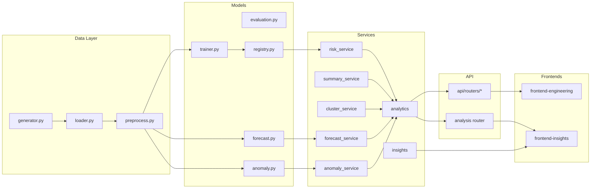

# GidroAtlas Analytics Platform

Платформа демонстрирует, как выглядит продакшн-уровень предиктивного мониторинга гидротехнических объектов: единственный формат `ObjectPassport`, локальные ML-пайплайны (риск, прогнозы, аномалии), rule-based интерпретации и два React-дашборда. Всё работает офлайн, без внешних API.

---

## Архитектура



### Директории

| Путь | Назначение |
| --- | --- |
| `backend/api/` | FastAPI-эндпоинты (`/ai/*`, `/datasets/upload`, `/analysis/*`, `/plots/*`) |
| `backend/services/` | SRP-сервисы (`risk`, `summary`, `cluster`, `forecast`, `anomaly`, `analytics`, `insights`) |
| `backend/models/` | ML-модули: тренировка, оценка, артефакты, форкаст, аномалии |
| `backend/data/` | Генерация и нормализация `ObjectPassport`, feature engineering |
| `backend/dashboards/` | Seaborn/Matplotlib графики (распределение рисков, геокарта) |
| `backend/ml_interpretation/` | Rule-based explain/recommend/simulate (никаких LLM) |
| `backend/utils/` | Логирование и вспомогательные функции |
| `frontend-engineering/` | React/Vite UI для инженеров (таблицы, метрики, графики, CSV upload) |
| `frontend-insights/` | UI для текстовых интерпретаций и симуляций |

---

## Формат данных: `ObjectPassport`

```text
name: str
region: str
resource_type: str        # ГЭС / гидроузел / водохранилище / шлюз / плотина …
water_type: str           # пресная / солёная / нет
fauna: bool               # наличие фауны
passport_date: date       # последняя паспортизация
condition: int            # 1 (критично) … 5 (отлично)
coordinates:
    lat: float
    lon: float
```

CSV (`backend/data/passports.csv` или данные из `/datasets/upload`) обязан содержать колонки:
`name, region, resource_type, water_type, fauna, passport_date, condition, lat, lon`.
Булевые значения (`fauna`) допускают `0/1` или `true/false`. Все загрузки проходят Pydantic-валидацию и нормализацию типов.

---

## ML Pipeline

- **Feature engineering** (`prepare_feature_frame`): строгие типы, нормализация булевых значений, расчёт `passport_age_years`.
- **ModelTrainer**: `LogisticRegression` + `StratifiedKFold`, `ROC-AUC`, `PR-AUC`, `accuracy`, `F1`, `precision/recall`. Артефакты версионируются как `classifier_vYYYYmmddHHMMSS.pkl`.
- **ModelRegistry**: хранит classifier/forecaster/anomaly артефакты, умеет загружать последний артефакт через `latest.txt`.
- **RiskService**: управляет датасетом, обеспечивает predictions, priority scoring, рекомендации, замену датасета и retrain.
- **ForecastService**: RandomForestRegressor по агрегированному времяному ряду.
- **AnomalyDetector/Service**: IsolationForest с параметризацией и метриками (mean/std/top score, threshold).
- **Summary/Cluster services**: отдельные слои для сводных метрик и кластеризации.
- **InsightService**: работает поверх локальных правил (`ml_interpretation/*`), полностью офлайн.

---

## Запуск

### Backend
```bash
cd backend
python -m venv venv
.\venv\Scripts\activate            # PowerShell
pip install -r requirements.txt
py -3.10 -m backend.train_model    # генерация данных + первичное обучение
py -3.10 -m uvicorn backend.main:app --host 0.0.0.0 --port 8000 --reload
```

### Frontends
```bash
# инженерный дашборд
cd frontend-engineering
npm install
npm run dev -- --host --port 5173

# insights UI
cd ../frontend-insights
npm install
npm run dev -- --host --port 5174
```
Фронты автоматически обращаются к `http(s)://<текущий-хост>:8000`.

### Docker
```bash
docker compose up --build
```

---

## Переобучение модели

```bash
cd backend
py -3.10 -m backend.train_model
```

Скрипт создаёт свежий `passports.csv`, тренирует классификатор, пишет метрики и сохраняет артефакт в `backend/models/artifacts/classifier/classifier_v*.pkl`. `AnalyticsService` всегда подхватывает последнюю версию.

---

## API-примеры

```http
POST /ai/predict
{
  "name": "Object-101",
  "region": "север",
  "resource_type": "ГЭС",
  "water_type": "пресная",
  "fauna": true,
  "passport_date": "2012-03-04",
  "condition": 3,
  "coordinates": { "lat": 57.221, "lon": 39.118 }
}
```

```http
POST /datasets/upload
Content-Type: multipart/form-data
file=@passports.csv
```

```http
GET /ai/summary
GET /ai/objects
GET /ai/clusters
GET /ai/forecast
GET /ai/anomalies
GET /ai/anomalies/stats
```

```http
GET /analysis/explain
GET /analysis/recommend
POST /analysis/simulate
{
  "name": "Object-101",
  "risk": 0.72,
  "resource_type": "ГЭС",
  "water_type": "солёная",
  "condition": 2
}
```

---

## Тесты

```bash
cd backend
py -3.10 -m pytest -q
```

- `tests/test_data.py` — генерация/загрузка `ObjectPassport`
- `tests/test_preprocess.py` — feature engineering
- `tests/test_model.py` — тренировка и контроль артефактов
- `tests/test_interpretation.py` — проверка локальных интерпретаций

---

## Дашборды

- **frontend-engineering** — таблица паспортов, индикаторы риска, карточки метрик, загрузка CSV, PNG-графики (распределение риска, карта координат).
- **frontend-insights** — текстовые объяснения аномалий, рекомендации и сценарный симулятор.

_Скриншоты можно добавить в `frontend-*/docs/` (плейсхолдеры)._

---

## Примечания

- Работает полностью локально, без OpenAI и внешних сервисов.
- Вся логика разбита на SRP-компоненты, снабжена docstrings и логами.
- ML-пайплайны можно тестировать и расширять без поломок фронтендов.

